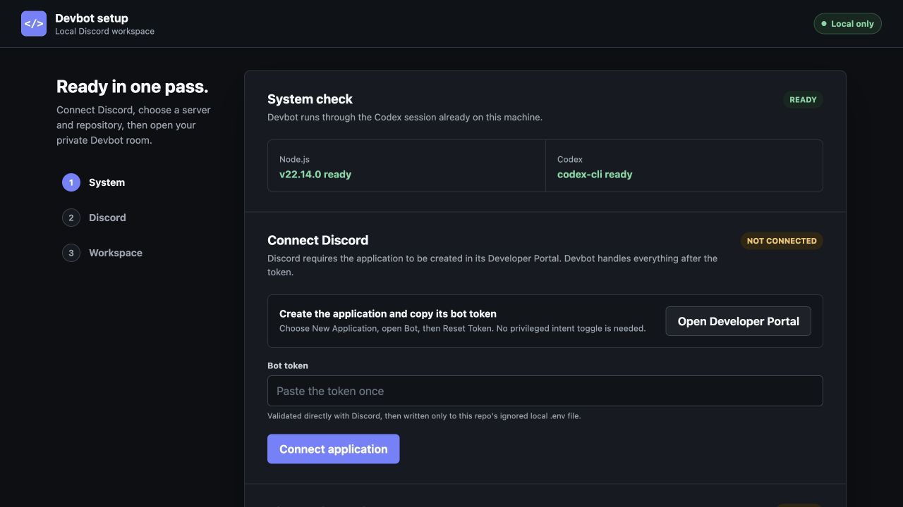
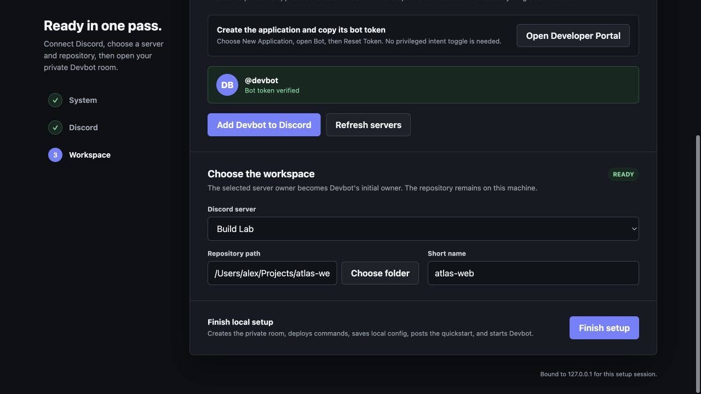
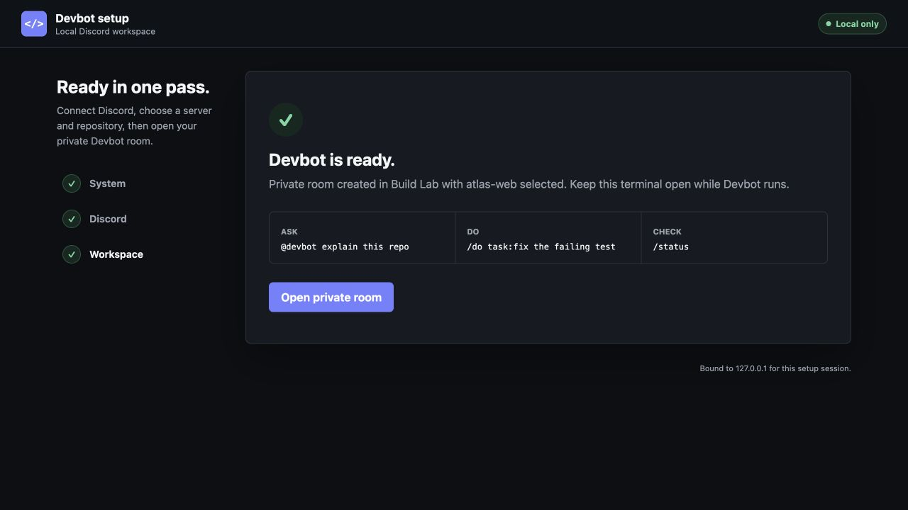

# Devbot

Devbot is a private, local-first Discord workspace for building software with Codex. It connects a Discord room to the repositories on your own machine, automatically chooses Luna, Terra, or Sol for each request, and can invite approved people and peer Devbots into the same workspace.

The everyday model is intentionally small:

- **Ask:** mention `@devbot` for an answer, or let an action-shaped mention open a proposal first.
- **Do:** approve a proposal, use the private task workroom, or use `/do` for an intentional project change.
- **Check:** use `/status` to see what is happening.

Devbot uses your signed-in local Codex CLI or app session and does not need a separate OpenAI API key or hosted Devbot backend. Selected project context is handled through that Codex session; Discord messages still travel through Discord.

## One-Command Setup

Prerequisites: Node.js 20 or newer, a signed-in Codex CLI or app, and a Discord account that can add apps to the target server.

1. Install dependencies and launch the local setup tool:

   ```bash
   npm install
   npm run setup
   ```

2. The setup page opens in your browser. Discord requires one manual platform step: create an application in the [Developer Portal](https://discord.com/developers/applications), open **Bot**, reset the token, and paste that token into the local setup page. Devbot then:



*Connect the Discord application without exposing the bot token in the repository.*

   - validates the bot directly with Discord
   - opens the correct server-install prompt with the required scopes and permissions
   - discovers the server after installation
   - uses the Discord server owner as the initial Devbot owner
   - registers the local repository with a native folder picker
   - creates a deny-by-default `devbot-private` room
   - deploys slash commands and posts a reusable Discord workspace launcher
   - writes the ignored local `.env` and `.devbot/setup.json` with owner-only file permissions
   - starts Devbot in the same terminal, or reuses an already-running local process



*Choose the Discord server and local repository; the remaining bootstrap work is automatic.*

The setup page binds only to `127.0.0.1`, validates its loopback host, protects its API with a per-run session secret, clears the pasted token field after validation, and never returns the token in an API response.

The Discord application itself cannot be created by Devbot: Discord's [application API](https://docs.discord.com/developers/resources/application) exposes read and edit operations for the current app, while creation and bot-token retrieval remain in the Developer Portal. Everything after that token is automated.

## Manual Setup

For advanced or headless environments, copy `.env.example` to `.env`, fill in `DISCORD_TOKEN`, `DISCORD_CLIENT_ID`, `DISCORD_GUILD_ID`, and `DEVBOT_OWNER_USER_ID`, then run `npm run dev`. Devbot synchronizes guild commands automatically. In Discord, `/setup wizard` creates or repairs the room, repositories, and approved access.

Then use it:

```text
@devbot explain how authentication works in this repo
/do task:fix the failing authentication test
/status
```



*The completion screen opens the private room and leaves users with the three everyday actions.*

The launcher opens a personal, ephemeral workspace with project selection and native **Ask**, **Make change**, **Status**, **Recent**, and **Refresh** controls. Tasks update one shared message through routing, context preparation, work, completion, failure, or cancellation. Safe public controls open role-aware private actions for follow-up, review, validation, retry, adjustment, and cancellation. Internal task and model IDs remain in task details instead of normal conversation.

For production, run:

```bash
npm run build
npm start
```

## Everyday Use

- **Workspace:** open the shared Devbot launcher or run `/dashboard`; choose a project and use its native controls.
- **Ask:** `@devbot <question>` or `/ask question:<text>` keeps the request read-only.
- **Do:** `/do task:<text>` is the intentional write-capable path for the owner and controllers.
- **Check:** `/status` reports current work, blockers, repository evidence, and the next action.
- **Set up:** `/setup wizard` is owner-only and resumable; `/setup doctor` diagnoses the full path.

The workspace remembers each approved user's selected project locally. Mentions, `/ask`, `/do`, `/status`, and `/dashboard` use that project when no explicit project is supplied. Every interaction rechecks current project access, controller authority, safe mode, and task state.

## Ambient Workrooms

Ideas 1-8 are implemented as the ambient workroom flow:

1. **Natural intent preview:** `@devbot fix the failing auth test` is classified as a proposed action and shown as a confirmation card. `@devbot why is auth failing?` remains an immediate read-only answer. The proposal offers **Approve and start**, **Edit**, **Answer only**, and **Decline**. Editing opens a modal; answer-only runs without write access.
2. **Private task threads:** an approved-room mention creates a private task thread and posts the proposal there. Unrestricted projects inherit the configured Devbot audience; scoped projects admit the requester and explicit project audience IDs. Eligible peers and the bot are added when project policy permits.
3. **Isolated work:** an approved write action runs from a separate `devbot/task/<task-name>` branch and worktree under `~/.devbot/worktrees` by default. The source checkout is left untouched. Changed-file and bounded diff-status evidence are saved, while the changes remain uncommitted for human review; Devbot does not merge or push them.
4. **Needs Me:** `/inbox` and the dashboard **Needs Me** control surface proposals and other decisions waiting for the current user. Open an item to see its private task detail, workroom, approval state, branch, changed files, and verification evidence.
5. **Proof-first completion:** completion cards show recorded proof before the result, including isolation evidence, changed files, and the route used. **Open proof** reveals the saved task detail; **Mark reviewed** clears the item from Needs Me for the requester and controllers.
6. **Project rooms:** the owner can bind a private channel or private thread to one project with `/setup project-room action:bind project:webapp channel:#webapp-room`. Mentions in that room are restricted to the bound project; remove the binding with `action:remove`.
7. **Workroom roles:** proposals default to **Builder**, **Reviewer**, and **Verifier**. The selector can change the team before approval: Builder proposes the smallest implementation, Reviewer checks scope and regressions, and Verifier defines completion evidence. These seats produce a read-only preflight brief before an approved action runs.
8. **Components V2:** proposal, progress, proof, and Needs Me surfaces use bounded Discord Components V2 containers with stable, allow-listed custom IDs and disabled controls when state changes. Content is sanitized and mentions are not expanded by these cards.

Example:

```text
@devbot update the billing retry copy in webapp
```

Review the private proposal, choose the roles, then select **Approve and start**. During execution, the workroom reports progress. On completion, inspect proof and the isolated branch before taking any repository action. For a read-only path, choose **Answer only** or write `/ask question:... project:webapp`.

Safety and fallback behavior are intentional. Only the requester or an approved controller can edit or decline a proposal; only the owner or an approved controller can approve write work or cancel it. `DEVBOT_SAFE_MODE=true` blocks approval and write execution. A project with a scoped audience declines channel-mention results and directs the user to the private workspace or `/ask`. If Discord cannot create a private task thread, an unrestricted proposal may remain in the configured private room; a scoped proposal is closed without publishing. If the target is not a Git repository, the worktree path is unsafe, or Git isolation is unavailable, the action stops before Codex receives write access and records the blocker in task evidence.

## Advanced Command Reference

- `/setup show`: Show owner-managed viewers, controllers, peer bots, private room, and project roots. Every `/setup` command is restricted to `DEVBOT_OWNER_USER_ID`.
- `/setup user action:<add|remove> user:<user> permission:<view|control>`: Manage private-room viewers. Controllers can also invoke write-capable commands; granting control automatically grants view access.
- `/setup devbot action:<add|remove> bot:<bot>`: Manage peer Devbots and their private-room access.
- `/setup repo action:<add|remove|default> name:<name> path:<required for add>`: Register a local project root or select the default used when a command omits `project`.
- `/setup project-room action:<bind|remove> project:<name> channel:<optional>`: Bind or remove a private ambient room for one project. The selected channel must be private, and every visible member must satisfy both the Devbot and project allowlists.
- `/setup room name:<optional>`: Create or resync the private Devbot room. It uses a deny-by-default text channel when Devbot can manage channels, otherwise it adopts or creates an invite-only private thread.
- `/projects`: List configured projects.
- `/status project:<optional> question:<optional> image:<optional>`: Show a decision-ready brief with confirmed Devbot tasks, task phase, external Codex runs, activity-unknown app sessions, repository evidence, visible blockers or risks, and the best next step. Add a question for a deeper read-only inspection, and set `image:true` to attach a live project UI screenshot when a local web app is detected.
- `/snip project:<optional> target:<text>`: Attach a live project UI screenshot by opening the running app and navigating visible UI controls from the target text. Explicit paths and local URLs are also supported.
- `/task recent project:<optional> status:<optional> limit:<optional>`: List recent saved devbot tasks from local task history.
- `/task show id:<task-id>`: Show one saved task with request, status, and result or error preview.
- `/task status id:<task-id>`: Alias for showing one saved task.
- `/task logs id:<task-id>`: Show the saved request, result preview, and error text.
- `/task cancel id:<task-id>`: Mark a running saved task as canceled in local history.
- `/task retry id:<task-id>`: Retry a saved task with the same project, mode, text, and include patterns.
- `/task stale minutes:<optional> project:<optional>`: List running tasks older than a selected threshold.
- `/dashboard project:<optional>`: Open the personal interactive workspace with project selection, current status, recent work, and native Ask / Change controls.
- `/inbox project:<optional> limit:<optional>`: Open the ephemeral **Needs Me** inbox for pending proposals and decisions, with review controls and refresh.
- `/run command:<name> project:<optional>`: Run a configured command from `<project>/.devbot/project.json`, using the selected default project when omitted.
- `/review packet project:<name> task:<optional>`: Create a provider-neutral review handoff packet from git status, diff stat, last commit, and optional task context.
- `/review validate project:<name> commands:<optional>`: Run configured validation commands.
- `/review gates project:<name> commands:<optional>`: Check merge gates without merging: clean working tree plus validation pass.
- `/devbot capabilities`: Show this bot's owner, safe mode, projects, and command capabilities.
- `/devbot announce`: Post a structured capability announcement for peer devbots.
- `/devbot peers`: List peer devbots that have announced themselves.
- `/peer status bot:<id-or-mention> project:<optional>`: Ask an allow-listed peer bot for read-only status.
- `/peer snip bot:<id-or-mention> target:<text> project:<optional>`: Ask an allow-listed peer bot for a live UI screenshot.
- `/lab council prompt:<text> project:<optional> seats:<optional 2-4>`: Open a persistent workroom on the selected default or explicit project with three independent local agent seats by default, plus invited peer bots, before the human reveals, challenges, synthesizes, approves, denies, or closes the room.
- `/lab roundtable project:<name> prompt:<text>`: Start a private devbot strategy room with role-based product, frontend, backend, testing, and risk angles.
- `/lab see target:<text> project:<optional>`: Collect a local screenshot plus peer screenshot requests for the same target.
- `/lab handoff project:<name> target:<human-or-bot> task:<optional>`: Create a baton-pass review handoff card and send a peer review-packet request when the target is an allow-listed bot.
- `/lab bossfight project:<name> task:<optional> commands:<optional>`: Build a merge-readiness boss bar from review packets, local gates, peer observers, and approval state.
- `/lab jam project:<name> theme:<text>`: Brainstorm playful options and convert the best one into a concrete task.
- `/lab argue project:<name> proposal:<text>`: Run a contrarian council against a proposal from speed, safety, UX, and maintenance angles.
- `/lab fix-from-snip project:<name> target:<text> complaint:<text>`: Capture visual context and produce an approval-ready fix plan.
- `/lab campfire minutes:<optional> project:<optional>`: Surface stale running tasks with recovery options.
- `/lab roster`: Show peer capability cards.
- `/lab ritual project:<name> task:<optional>`: Build a merge ritual card with review packet, recent tasks, and safety state.
- `/lab recent`: List recent collaboration lab sessions.
- `/lab events id:<collab-id>`: Show recent events for a lab session.
- `/lab approve id:<collab-id> decision:<approve|deny|read-only> action:<record|validate|gates> project:<optional> commands:<optional> note:<optional>`: Record a human approval, denial, or read-only decision, optionally running validation or gates after approval.
- `/lab safety project:<optional>`: Show active collaboration safety rules and approval boundaries.
- `/refresh project:<name>`: Rebuild the in-memory file index for a project.
- `/ask question:<text> project:<optional> include:<optional patterns>`: Ask the model a question with local project context.
- `/do task:<text> project:<optional> include:<optional patterns>`: Ask local Codex to perform a focused project task. Requires owner or controller access.
- `/queue add task:<text> project:<optional> mode:<ask|do>`, `/queue list`, `/queue remove position:<n>`, `/queue clear`, `/queue start stop-on-failure:<optional>`, `/queue stop`, `/queue digest`: Stack tasks before bed and run them one at a time through the same Ask/Do path, then post one morning digest to the private room when the queue drains. Requires owner or controller access, and survives a restart.
- `/schedule add spec:<text> task:<text> project:<optional> mode:<ask|do>`, `/schedule list`, `/schedule remove id:<id>`, `/schedule pause id:<id>`, `/schedule resume id:<id>`: Owner-only recurring tasks using `daily HH:MM`, `weekdays HH:MM`, or `every <N>h` specs, checked every 30 seconds and restart-safe.

You can also mention the bot in a channel:

```text
@devbot explain why the failing test is failing
@devbot project:api include:src/* where are failed webhooks handled?
@devbot what's currently in progress
@devbot what's the status on the web build, send me a snip of the browse page
```

Read-only mentions use the invoking user's workspace project, then the setup-selected default as a fallback. An action-shaped mention opens a proposal instead of changing files; write-capable work starts only after an explicit approval. Use `project:<name>` to override the selection for one mention. Inside a project room, the room binding wins and a mention for another project is declined.

Status-style mentions such as `@devbot wip`, `@devbot current dev work`, or `@devbot give me a breakdown of what you are working on` return the decision-ready brief without invoking Codex. Devbot distinguishes confirmed work from an open Codex app session, because an open session can be working, waiting, or idle. It never exposes process IDs or private external prompts. Generic requests for blockers and next steps stay deterministic; diagnostic questions about failures, diffs, remaining work, or merge readiness trigger the deeper read-only Codex inspection. If the message asks for a snip, screenshot, image, or picture, the bot tries to attach a live project UI screenshot. Page hints such as `browse page` or `watchlist` are handled by opening the running app and navigating through visible UI controls instead of reading framework routes from disk. Explicit paths like `/cards/op01-016` are still supported when you want an exact target.

The optional `include` field accepts comma-separated path patterns. `*` is supported as a wildcard, so examples like `src/*`, `README.md`, or `*.json` work.

Task history is stored locally in `.devbot/tasks.json` by default. Per-user project selection lives in `.devbot/preferences.json`, peer registry state in `.devbot/peers.json`, collaboration workrooms in `.devbot/collab.json`, and owner-managed setup in `.devbot/setup.json`. Set `DEVBOT_TASK_STORE`, `DEVBOT_PREFERENCES_STORE`, `DEVBOT_PEER_STORE`, `DEVBOT_COLLAB_STORE`, or `DEVBOT_SETUP_STORE` to use different files; relative paths resolve from the devbot process working directory.

## Owner Setup And Visibility

`DEVBOT_OWNER_USER_ID` is the immutable bootstrap authority for `/setup`; it cannot be changed from Discord. Once `/setup room` creates the private room, normal slash commands and mentions are accepted only there. A managed text channel denies `ViewChannel` to `@everyone`; the no-`Manage Channels` fallback uses private-thread membership. Both grant access to effective ID-based viewers, controllers, the owner, the bot itself, and allow-listed peer bots. This is the layer that controls who can actually see Devbot messages. Ordinary messages previously posted in other Discord channels cannot be retroactively hidden.

Environment allowlists and static project maps remain bootstrap inputs. Discord setup augments them and never edits `.env`. Removing a user or repo from setup does not remove an equivalent entry still present in `.env`, `PROJECTS_JSON`, or `config/projects.json`.

## Project Metadata

Each target project can define optional metadata at `<project>/.devbot/project.json`.

```json
{
  "canonicalName": "webapp",
  "frontendUrl": "http://127.0.0.1:3000",
  "defaultBranch": "main",
  "aliases": ["web", "frontend"],
  "commands": {
    "test": ["npm test"],
    "build": ["npm run build"],
    "verify": ["npm run build && npm test"],
    "presets": {
      "quick-check": "npm run build"
    }
  },
  "policy": {
    "visibility": "team",
    "allowedUsers": [],
    "allowedUsernames": [],
    "allowedRoles": [],
    "allowedPeers": [],
    "screenshotPolicy": "approval",
    "readOnlyCommands": ["test"],
    "approvalRequiredCommands": ["verify"]
  }
}
```

Devbot only runs commands declared in that metadata file. `DEVBOT_SAFE_MODE=true` disables write-capable work: `/do`, action-task retries, `/run`, `/review validate`, and `/review gates`.

Global access can be limited with `ALLOWED_USER_IDS`, `ALLOWED_USERNAMES`, and `ALLOWED_ROLE_IDS`. User IDs are the most stable option. Account usernames are matched case-insensitively; mutable global display names and guild nicknames are intentionally ignored.

Project policy lets each repo narrow collaboration behavior. `allowedUsers`, `allowedUsernames`, and `allowedRoles` scope project-specific slash command access, `allowedPeers` limits peer bot access per project, and `screenshotPolicy` can be `allow`, `approval`, or `deny`. Omitted screenshot policy defaults to approval. Commands must be named in `readOnlyCommands` to avoid an approval gate; unclassified commands fail closed.

When a project has any user or role allowlist, Devbot keeps workspace, `/ask`, `/do`, `/status`, `/snip`, `/task`, `/run`, `/review`, continuation, and retry results ephemeral so other members of the shared room cannot read them. Because channel mentions cannot be selectively hidden, Devbot declines mention-based results for those projects and points the user to the private workspace or `/ask`.

## Peer Bots

For multi-dev servers, each developer can run a separate bot application and add the other bot accounts with `/setup devbot`. `PEER_BOT_IDS` remains available as a bootstrap configuration.

Use `/devbot announce` to publish capabilities. Basic peer requests are sent as structured Discord messages for capabilities, status, and screenshots. The `/lab` workflows add versioned collaboration envelopes for planning, review packets, screenshot requests, approval cards, and event recording.

`/lab council` is the first persistent multiplayer workflow. It runs independent Product Steward, Systems Builder, and Evidence Verifier seats in parallel by default; `seats:4` adds an Operations Guardian. It opens a private Discord thread when the channel and bot permissions support one, stores stable participant IDs and correlated peer invitations, hides proposals from normal workroom views during collection, and exposes native decision buttons. Peer fan-out requires a dedicated private text channel or private thread in `COORDINATION_CHANNEL_ID`; without both a private workroom and coordination room the council runs local-only in an ephemeral response. Devbot automatically unarchives a configured coordination thread and adds allow-listed peer bots before sending. Sealing prevents agents from anchoring on earlier responses; it is an application-level visibility rule, not encryption of the Discord transport or local state file. See [Collaboration Protocol](docs/COLLABORATION_PROTOCOL.md).

The safety boundary is deliberate: peer bots can ask, observe, plan, review, and hand off inside allow-listed projects. Peer-triggered edits, command execution, validation with side effects, pushes, merges, deploys, dependency installs, and secret/config changes require explicit human approval.

## Security Boundaries

- Discord-launched Codex processes receive a minimal environment without the bot token or application credentials. Prompts are sent over standard input instead of command-line arguments, user config and rules are ignored, optional tools are disabled, and `danger-full-access` is rejected.
- Git inspection and isolated-worktree operations run without inherited credentials, hooks, signing, filesystem monitors, pagers, or external diff helpers. Repositories with locally configured checkout filters are refused before a worktree is created.
- Retained isolated worktrees are capped at 100 by default so abandoned task branches cannot grow without bound; remove reviewed worktrees before starting more.
- Screenshots are limited to configured or detected loopback origins. Redirects and browser subresources are restricted to those approved origins; arbitrary localhost ports, remote hosts, credentials in URLs, and link-local metadata addresses are rejected.
- Local task, setup, preference, peer, and collaboration state is written owner-only inside owner-only directories. Responses, stored results, errors, command output, and indexed context pass through credential redaction.
- These controls reduce exposure but do not make untrusted repositories harmless. Keep credentials out of project roots, review isolated changes before applying them, use ID-based Discord allowlists, and leave screenshot policy at `approval` unless a project UI is safe to post.

## Project Context Behavior

Before a project request runs, Devbot can use a separate read-only routing model to choose both model capacity and prepacked context:

- **Luna / direct:** greetings, pings, and generic questions without repository context.
- **Terra / focused:** targeted questions and ordinary scoped work with ranked project snippets.
- **Sol / deep context:** architecture, security, migrations, broad diagnosis, and consequential changes.

The friendly route is shown while Devbot works; concrete model IDs and routing diagnostics are kept in task details. The routing model cannot change answer/action mode, grant controller access, or loosen the Codex sandbox. Deterministic validation prevents an action from being routed below Terra with focused context, and a local fallback policy takes over if the router times out or returns malformed output.

Configure the family with `CODEX_ROUTER_MODEL`, `CODEX_FAST_MODEL`, `CODEX_STANDARD_MODEL`, and `CODEX_DEEP_MODEL`. Reasoning effort and the focused context budget have separate environment controls; see `.env.example`.

The scanner ranks files by path and content matches against your question or task, then passes a bounded set of relevant snippets to local Codex.

By default:

- `/ask` uses `CODEX_SANDBOX=read-only`.
- `/do` uses `CODEX_ACTION_SANDBOX=workspace-write`.
- Discord-triggered Codex runs reject `danger-full-access`, receive a minimal credential-free child environment, and take prompts over stdin rather than process arguments.
- Local task, setup, peer, collaboration, preference, and runtime state use owner-only files; active task and collaboration directories are hardened to owner-only access on supported systems.

Defaults are conservative:

- Maximum indexed file size: `80 KB`
- Maximum context per file: `12 KB`
- Maximum packed project context: `120,000 characters`
- Default ignored paths include `.git`, `node_modules`, `dist`, `build`, `coverage`, `.env`, private keys, logs, and common binary media files

Tune these in `src/config.ts` if you need a larger or smaller context window.

## License

MIT. See `LICENSE`.

## Discord App Notes

In the Discord Developer Portal, create an application, add a bot, enable the bot token, and invite it to your server with these scopes:

- `bot`
- `applications.commands`

The bot needs permission to read and send messages in the channels where you use it. `/setup room` prefers `Manage Channels`, but can adopt or create a private thread when it has `Create Private Threads`. Directly mentioned messages are one of Discord's documented [Message Content intent exceptions](https://docs.discord.com/developers/events/gateway#message-content-intent), so Devbot does not request that privileged intent.
